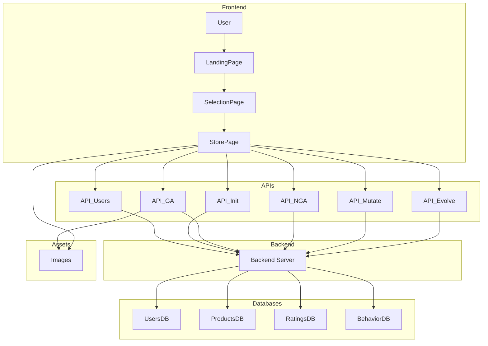

# BIA601
# تحسين التوصيات في المتاجر الإلكترونية باستخدام الخوارزمية الجينية

> مشروع BIA601 – الخوارزميات الذكية | الفصل الدراسي S25

[](https://github.com/ayoushka/BIA601)
[](https://bia601.vercel.app/)
[](https://drive.google.com/file/d/1i9PVoDBsoY7l6SMyc-K7oTNok6eELgMM/view?usp=sharing)

---

## نظرة عامة

يُعد نظام التوصيات في المتاجر الإلكترونية أداة أساسية لمساعدة المستخدمين على اكتشاف المنتجات المناسبة، لكن التوصيات العشوائية أو العامة غالباً لا تلبي احتياجات كل مستخدم على حدة. يهدف هذا المشروع إلى تحسين جودة التوصيات باستخدام **الخوارزمية الجينية (Genetic Algorithm)** المستوحاة من نظرية الانتقاء الطبيعي. يقوم النظام بتحليل سلوك المستخدم (مشاهدة، نقر، شراء) وتقييماته السابقة، ثم يطبق عمليات التطور (الاختيار، التقاطع، الطفرة) على مجموعات من قوائم التوصيات لتوليد أفضل 5 منتجات مقترحة لكل مستخدم.

قمنا بتحديث المشروع ليقدم واجهة تفاعلية متقدمة تتيح المقارنة الحية بين التوصيات العشوائية (NGA) والتوصيات الذكية (GA).

---

## الميزات الرئيسية

- **خوارزمية جينية حقيقية** – تمثيل الكروموسومات كقوائم منتجات، مع دالة لياقة تعتمد على سلوك المستخدم المخصص (شراء، مشاهدة، نقر).
- **مقارنة تفاعلية (GA vs NGA)** – إمكانية التبديل بين التوصيات العشوائية (NGA) والتوصيات المدعمة بالذكاء الاصطناعي (GA) لمعاينة الفرق الفعلي.
- **ملف مستخدم ديناميكي (Data DNA)** – عرض لوحة بيانات توضح اهتمامات المستخدم وسلوكه ضمن الفئات.
- **واجهة مستخدم حديثة تفاعلية** – مبنية باستخدام React و Tailwind CSS، وتتضمن ميزات المتجر الحقيقية (عربة تسوق، شراء، وتحديث المنتجات عبر الطفرة).
- **صور ديناميكية محلية** – ربط المنتجات بصور حقيقية منظمة حسب الفئات لضمان تجربة مستخدم واقعية.
- **خلفية API قوية** – مبنية بواسطة FastAPI لضمان سرعة الاستجابة لمعالجة الخوارزمية.
- **حفظ الجلسة (State Persistence)** – الاحتفاظ ببيانات المستخدم وتفضيلاته باستخدام `localStorage` بحيث لا تتأثر التوصيات عند تحديث المتصفح.
- **جاهز للنشر السحابي (Vercel Ready)** – إعدادات توجيه متقدمة باستخدام `vercel.json` لضمان عمل الواجهة والخادم معاً بسلاسة.

---

## آلية عمل الخوارزمية الجينية

| المرحلة | الشرح |
|---------|-------|
| **التهيئة (Initialization)** | بناء مجموعة أولية من التوصيات موجهة نحو الفئة المفضلة للمستخدم لتسريع الوصول للحل الأمثل، مع ضمان عدم تكرار المنتجات. |
| **دالة اللياقة (Fitness)** | `اللياقة = (Purchased × 10) + (Clicked × 5) + (Viewed × 1) + Avg_Rating` (مخصصة ومحسوبة لكل مستخدم على حدة). |
| **الاختيار (Selection)** | اختيار أفضل حلين (الأعلى لياقة) ليكون آباءً للجيل القادم. |
| **التقاطع (Crossover)** | دمج منتجات الأبوين للحفاظ على الجينات (المنتجات) الجيدة وتوليد تشكيلة جديدة بدون التضحية بالترتيب أو تكرار المنتجات (Unique Sequence). |
| **الطفرة (Mutation)** | استبدال منتج غير ملائم بمنتج جديد من قائمة المنتجات التي لم يشاهدها المستخدم من قبل لاكتشاف اهتمامات جديدة (Discovery). |

---

## هيكل المشروع
BIA601_Project/
├── api/                      # FastAPI end-points & تطبيق الخوارزمية الجينية
│   ├── index.py              # النقطة الأساسية للخادم الخلفي
│   ├── requirements.txt      # مكتبات Python المطلوبة
│   ├── users.csv             # بيانات المستخدمين
│   ├── products.csv          # بيانات المنتجات
│   ├── ratings.csv           # بيانات التقييم (يتم توليده إن لم يوجد)
│   └── behavior_15500.csv    # بيانات تفاعل وسلوك المستخدمين
├── frontend/
│   ├── index.html            # نقطة دخول تطبيق React
│   ├── package.json          # إعدادات مكتبات Node.js و Vite
│   ├── public/               # مجلدات صور المنتجات مرتبة حسب الفئات (books, toys...)
│   └── src/
│       ├── components/       # مكونات الواجهة (LandingPage, StorePage, ProductCard...)
│       ├── App.jsx           # التطبيق الرئيسي وإدارة مسارات التنقل (Routing)
│       └── main.jsx          # نقطة انطلاق التطبيق
├── vercel.json               # إعدادات النشر وتوجيه المسارات لمنصة Vercel
├── report.md                 # التقرير الفني للمشروع
└── README.md                 # هذا الملف الشارح

---

## بنية النظام
 System Architecture

This section explains the system architecture in a clear and structured way.

---

🔹 1. User Flow

flowchart LR
    User([ User]) --> Landing[ Landing Page]
    Landing --> Selection[ Selection Page]
    Selection --> Store[ Store Page]

---

🔹 2. API Interaction

flowchart LR

    Store[ Store Page]

    subgraph APIs
        U[ Users API]
        I[ Init API]
        GA[ GA API]
        NGA[ Next GA API]
        M[ Mutate API]
        E[ Evolve API]
    end

    Server[ Backend Server]

    Store --> U
    Store --> I
    Store --> GA
    Store --> NGA
    Store --> M
    Store --> E

    U --> Server
    I --> Server
    GA --> Server
    NGA --> Server
    M --> Server
    E --> Server

---

🔹 3. Data Layer

flowchart LR

    Server[ Backend Server]

    subgraph Databases
        Users[( Users DB)]
        Products[( Products DB)]
        Ratings[( Ratings DB)]
        Behavior[( Behavior DB)]
    end

    Server --> Users
    Server --> Products
    Server --> Ratings
    Server --> Behavior

---

🔹 4. Images Handling

flowchart LR

    Store[ Store Page]
    GA[ GA API]
    Images[( Images Storage)]

    GA -->|serve via /images/| Images
    Store -->|load images| Images

---

📌 Summary

- The system is divided into clear layers:
  
  - Frontend (User Interface)
  - API Services
  - Backend Logic
  - Data Storage
  - Assets Handling

- This separation improves:
  
  - Maintainability
  - Scalability
  - Readabilityهذا الملف الشارح

---

## المخطط الصندوقي



---

## التقنيات المستخدمة

| المجال | الأدوات والمكتبات |
|--------|------------------|
| **الخلفية (Backend)** | Python 3.10+, FastAPI, Uvicorn, Pandas, NumPy |
| **الخوارزمية الجينية** | برمجة المنطق من الصفر داخل الـ Backend لضمان الدقة وتخصيص التسلسل |
| **الواجهة (Frontend)** | React (Vite), Tailwind CSS, React Router, Lucide Icons |
| **البيانات** | قراءة وتحليل ملفات CSV (تم استبدال Excel لتحسين السرعة) باستخدام Pandas |
| **التحكم بالإصدارات** | Git + GitHub |

---

## كيفية تشغيل المشروع محلياً 

### المتطلبات المسبقة
- Node.js (لتشغيل الواجهة الأمامية Vite)
- Python 3.10 أو أحدث
- pip (مدير حزم Python)
- Git

### الخطوات

1. **استنساخ المستودع**
   في موجه الأوامر (CMD/Terminal)، اكتب:
   ```bash
   git clone https://github.com/ayoushka/BIA601.git
   cd BIA601
   ```

2. **إعداد وتشغيل الخادم الخلفي (Backend)**
   انتقل إلى المجلد الخلفي، وقم بتثبيت المتطلبات وتشغيل السيرفر:
   ```bash
   cd api
   pip install -r requirements.txt
   uvicorn index:app --reload
   ```
   *بمجرد ظهور رسالة "Successfully loaded all CSV files!"، سيعمل الخادم على الرابط: `http://127.0.0.1:8000`*

3. **إعداد وتشغيل الواجهة الأمامية (Frontend)**
   في نافذة أوامر جديدة (New Terminal)، انتقل لمجلد الواجهة، ثبت الحزم، وشغل الخادم:
   ```bash
   cd frontend
   npm install
   npm run dev
   ```
   *سيتم توفير رابط محلي (غالباً `http://localhost:5173`)، افتحه في متصفحك لمعاينة الموقع.*

4. **تجربة التطبيق التفاعلي**
   - من الصفحة الرئيسية، انقر على زر "ابدأ باختبار الخوارزمية".
   - اختر واحداً من المستخدمين لاختبار تفضيلاته.
   - قم بالتبديل بين التوصيات العشوائية **NGA** والتوصيات الذكية عبر الخوارزمية الجينية **GA**.
   - يمكنك النقر على أزرار التفاعل (Add to Cart, Buy) لاختبار تفاعل المتجر، أو استبعاد منتج (Remove/Unfit) لتوليد **طفرة** بمنتج جديد كلياً ومفاجئ للمستخدم.

---

**أعضاء الفريق**
- آية عمر بلال (aya_189191)
- محمد محمد بسام علايا (mohammad_188524)
- ريم راتب عدس (Reem_196911)
- نعمى عبد الله عبد الباقي (nouma_153725)
- مهند زياد الشعار (muhannad_al_shaar_202846)
- نور ميلاجي (Nour_223981)
